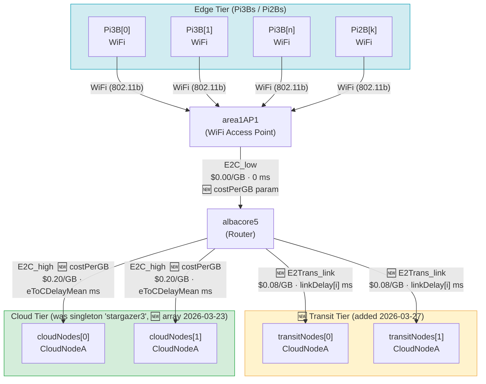
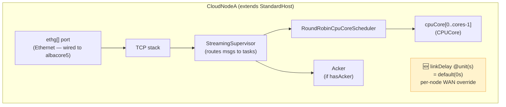
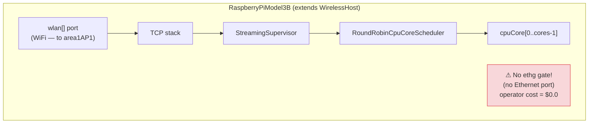
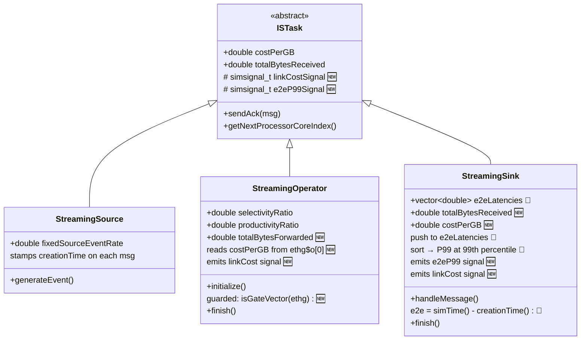
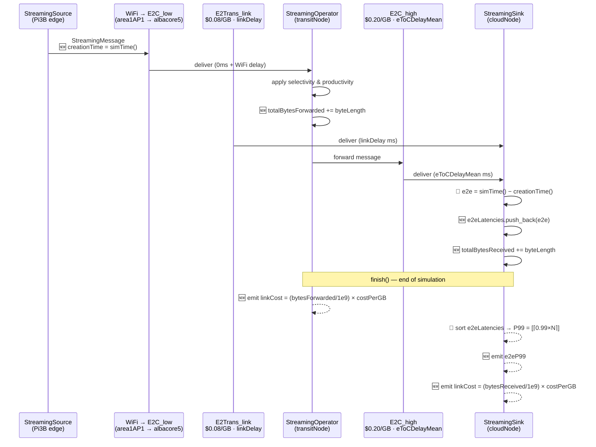
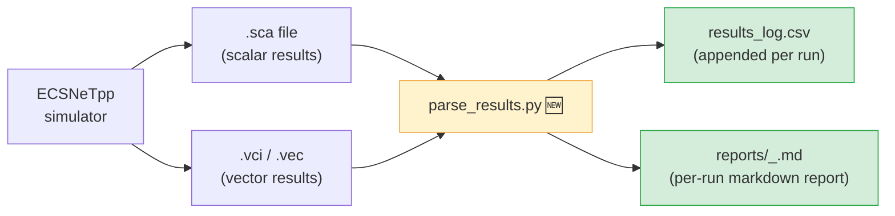
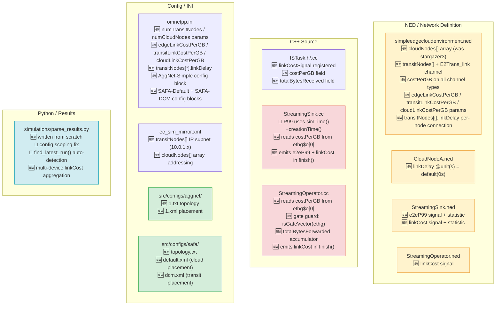
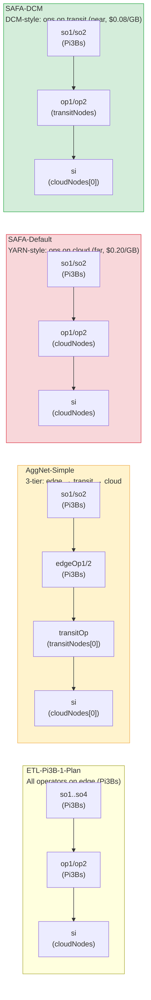

# ECSNeTpp — Architecture Overview & Change Map

This document describes the simulator architecture and annotates every component
that was modified during the thesis project. Diagrams use [Mermaid](https://mermaid.js.org/)
(rendered natively in GitHub, GitLab, and most modern Markdown viewers).

---

## 1. Physical Network Topology

The simulator models a **star topology** with three tiers. All edge devices share
a single WiFi uplink through `area1AP1` → `albacore5`.



**Key files:** `src/networks/simpleedgecloudenvironment.ned`, `src/configs/ec_sim_mirror.xml`

---

## 2. Node Module Internals

### 2a. CloudNodeA — used for both `cloudNodes[]` and `transitNodes[]`



`linkDelay` is read by `simpleedgecloudenvironment.ned` at connection time:
```ned
transitNodes[i].ethg++ <--> E2Trans_link { delay = transitNodes[i].linkDelay; } <--> albacore5.ethg++;
```
Set per-node in `omnetpp.ini`: `*.transitNodes[0].linkDelay = 2ms`

**Key files:** `src/host/CloudNodeA.ned`

### 2b. RaspberryPiModel3B — edge device



Pi3Bs have **no `ethg` gate** — the gate guard added in `StreamingOperator` prevents a crash
when trying to read the channel cost for WiFi-hosted operators.

---

## 3. Streaming Task Class Hierarchy



**Legend:** `🆕` = newly added &nbsp;|&nbsp; `🔧` = fixed/changed

**Key files:** `src/stask/ISTask.h/.cc`, `src/stask/StreamingOperator.h/.cc/.ned`,
`src/stask/StreamingSink.h/.cc/.ned`

---

## 4. Message Flow Through the System

This shows how a single `StreamingMessage` travels from source to sink, and where
the thesis changes intercept it.



---

## 5. Results Pipeline



**Parser changes (🆕 written from scratch 2026-03-24, 🔧 fixed 2026-03-27):**
- `find_latest_run()` — detects which config ran from newest `.sca` filename
- `parse_ini(target_config)` — scopes to the right `[Config X]` section; falls back to `defaultplan`
- Sums `linkCost` across ALL device labels (operators + sinks) for true multi-hop total
- Reports: per-sink E2E breakdown, P99, link cost (USD), throughput

---

## 6. Annotated Change Map

Summary of every file touched and why.



**Colour key:**
- Yellow = NED / structural changes
- Red = C++ logic changes (fixes + new behaviour)
- Green = new scenario configs
- Blue = tooling / parser

---

## 7. Scenarios at a Glance



---

## 8. Chronological Change Summary

| Date | What | Files |
|------|------|-------|
| 2026-03-23 | `cloudNodes[]` array (replaced singleton `stargazer3`) | `simpleedgecloudenvironment.ned`, all placement XMLs, `ec_sim_mirror.xml`, `omnetpp.ini` |
| 2026-03-24 | Link cost model — `costPerGB` on channels, tracked at `StreamingSink` | `simpleedgecloudenvironment.ned`, `StreamingSink.h/.cc/.ned`, `ISTask.h/.cc` |
| 2026-03-24 | Results parser written from scratch | `simulations/parse_results.py` |
| 2026-03-27 | Transit tier — `transitNodes[]` + `E2Trans_link` ($0.08/GB) | `simpleedgecloudenvironment.ned`, `ec_sim_mirror.xml`, `omnetpp.ini` |
| 2026-03-27 | AggNet-Simple scenario | `src/configs/aggnet/`, `omnetpp.ini` |
| 2026-03-27 | Operator link cost tracking + WiFi gate guard | `StreamingOperator.h/.cc/.ned`, `ISTask.h/.cc` |
| 2026-03-27 | P99 fix — use `simTime() − creationTime()` | `StreamingSink.cc` |
| 2026-03-27 | Parser config scoping fix + `find_latest_run()` | `simulations/parse_results.py` |
| 2026-03-29 | SAFA-Default and SAFA-DCM scenarios | `src/configs/safa/`, `omnetpp.ini` |
| 2026-04-01 | Per-node transit delay — `linkDelay` param on `CloudNodeA` | `CloudNodeA.ned`, `simpleedgecloudenvironment.ned`, `omnetpp.ini` |
